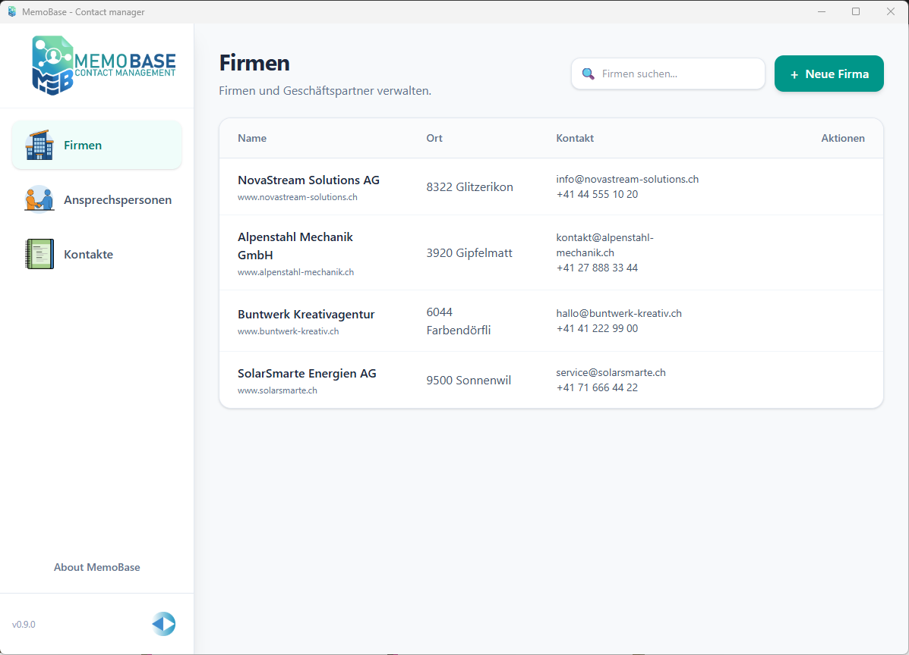
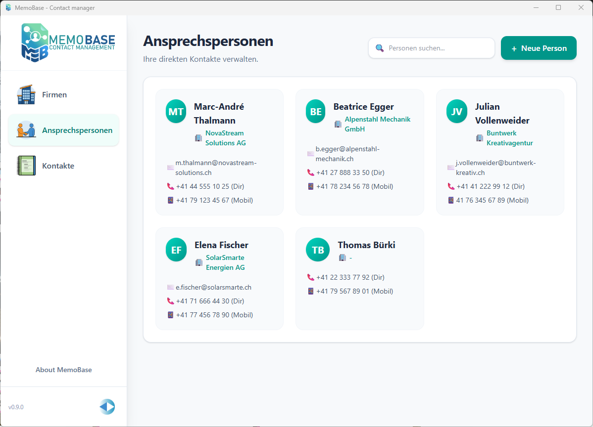
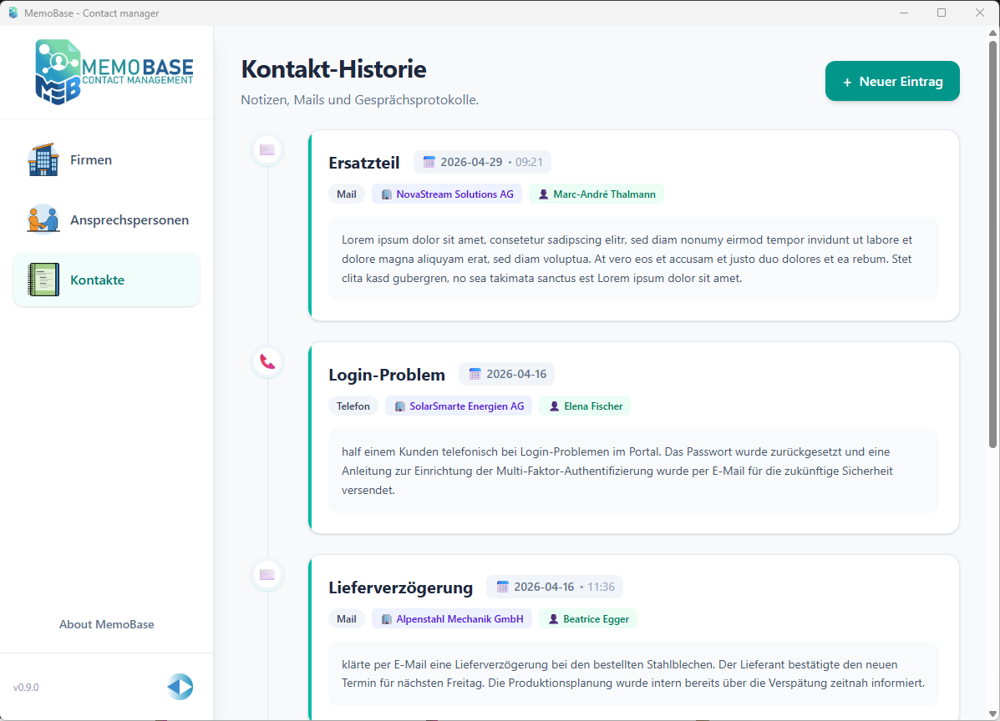

# MemoBase

MemoBase is a modern, local-first contact management desktop app built with [Tauri](https://tauri.app/), [SvelteKit](https://kit.svelte.dev/), and [Rust](https://www.rust-lang.org/). It provides a streamlined interface for managing company profiles, contact people, and interaction history, backed by a fast, embedded SQLite database.

## Download

Grab the latest installer for your operating system from the [**Releases page**](https://github.com/NC-PB/MemoBase/releases/latest):

| Platform | File to download |
| --- | --- |
| **Windows** | `MemoBase_x.y.z_x64-setup.exe` (or the `.msi`) |
| **macOS (Apple Silicon)** | `MemoBase_x.y.z_aarch64.dmg` |
| **macOS (Intel)** | `MemoBase_x.y.z_x64.dmg` |
| **Linux** | `MemoBase_x.y.z_amd64.AppImage`, `.deb`, or `.rpm` |

> Note: MemoBase is not code-signed yet. On macOS you may need to right-click the app and choose **Open** the first time; on Windows, click **More info -> Run anyway** if SmartScreen appears.

## Screenshots

| Companies | Contact people | Interaction log |
| --- | --- | --- |
|  |  |  |

## Features

- **Company Management**: Full CRUD for company profiles, including clickable website and social media links.
- **Contact People**: Keep track of individual contacts associated with each company.
- **Interaction Logs**: Record and review a history of interactions with your contacts.
- **Modern Dashboard**: Responsive UI built with Tailwind CSS, including a collapsible sidebar and custom branding.
- **Local First**: Powered by Tauri and an embedded SQLite database, so your data stays private and on your machine.

## Tech Stack

- **Frontend**: SvelteKit, TypeScript, Tailwind CSS
- **Backend**: Rust, desktop runtime via Tauri
- **Database**: SQLite (via `rusqlite`)

## Building from Source

### Prerequisites

- [Node.js](https://nodejs.org/en/) (LTS recommended)
- [Rust](https://www.rust-lang.org/tools/install)
- Platform build tools per the [Tauri Prerequisites Guide](https://tauri.app/start/prerequisites/) (e.g. C++ build tools on Windows, `webkit2gtk` on Linux).

### Install & run

```bash
npm install        # install frontend dependencies
npm run tauri dev  # run the app in development mode
```

### Build a local installer

```bash
npm run tauri build
```

The compiled binaries and installers are written to `src-tauri/target/release/bundle/`.

## Creating a Release (maintainers)

Cross-platform installers are built automatically by GitHub Actions (see [`.github/workflows/release.yml`](.github/workflows/release.yml)). Each OS must be built on its own runner, so the workflow builds macOS, Linux, and Windows in parallel and uploads everything to a single GitHub Release.

To cut a release using **GitHub Desktop**:

1. Bump the version in `package.json`, `src-tauri/Cargo.toml`, and `src-tauri/tauri.conf.json` if needed, then commit and push.
2. In GitHub Desktop, open the **History** tab, right-click the latest commit, and choose **Create Tag...**. Name it `v0.1.0` (must start with `v`).
3. Go to the **Repository** menu and choose **Push** — this pushes the tag and starts the build.
4. Watch progress on the repo's **Actions** tab on GitHub.com. When it finishes, a **draft** release appears under **Releases** with the installers attached.
5. Review the draft, then click **Publish release** to make it available for download.

You can also start a build without a tag from the **Actions** tab on GitHub.com: select **Release** -> **Run workflow**.

## License

[MIT](LICENSE)
